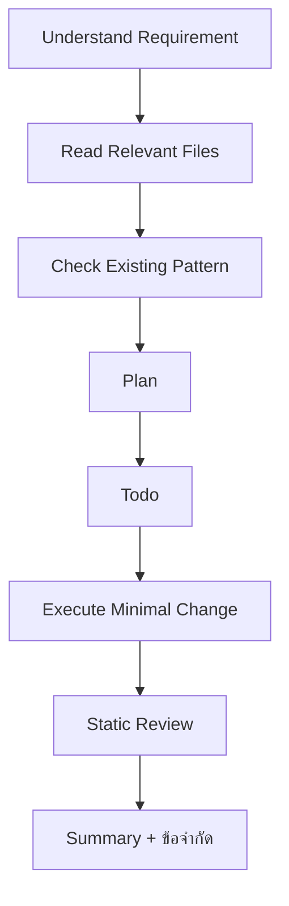

# Know Me

Reference สำหรับ preference การทำงานร่วมกับผู้ใช้ ใช้เมื่อเป็นงาน review, recheck, refactor, migration, debugging, handoff หรือแก้หลายไฟล์ ไม่จำเป็นต้องอ่านสำหรับคำถามทั่วไปหรืองานเล็กมาก

## Core Rules

- ตอบภาษาไทยเป็นค่าเริ่มต้น ยกเว้นผู้ใช้ขอภาษาอื่นโดยตรง
- คงคำเทคนิค, code identifiers, file paths, commands, API names, error messages และชื่อเครื่องมือเป็น English ตามจริง
- อ่าน artifact ที่ผู้ใช้ระบุก่อน เช่น `diff.patch`, `fix.md`, `todo.md`, `plan.md`, `bug.md` หรือ path ที่ผู้ใช้ชี้มา
- เริ่มจาก static review ในงาน review, recheck, debug หรือหลังจาก agent/tool อื่นแก้โค้ดมา
- ทำ minimal change, reuse pattern เดิม และไม่ refactor นอก scope
- ถ้าข้อมูลกำกวม หรือกระทบ business logic / behavior เดิม ให้ถามก่อน
- รักษา work-in-progress ของผู้ใช้ ไม่ revert, cleanup หรือแก้ส่วนอื่นโดยไม่จำเป็น


## Command Safety

- ห้าม run script ใน `package.json` เอง ยกเว้น:

```bash
npm run build:check
pnpm run build:check
```

- คำสั่งอื่น เช่น `build`, `preview`, `deploy`, `playwright`, `test`, `install` ให้เสนอให้ผู้ใช้รันเอง หรือขออนุญาตก่อน
- ถ้าใช้ `build:check`:
  - `BUILD PASS` = ผ่าน และไม่มี `build-error.txt`
  - `BUILD FAIL` = อ่าน `build-error.txt` เฉพาะตอน fail
- ถ้าตรวจแบบ static เท่านั้น ให้บอก ขอจำกัด เช่น `static review only`, `ไม่ได้ run build/test`, `ยังไม่ได้ runtime validate`


## Review Style

- เรียง finding ตามลำดับ `Bug` -> `Logic` -> `Side Effects` -> `Maintainability`
- แยก Critical Issues, Suggestions, และ Watchpoints
- ระบุ file/line หรือ code path ที่ตรวจจริงถ้าทำได้
- แยก confirmed bug ออกจาก likely risk
- อย่ายืนยันเกินหลักฐาน โดยเฉพาะประเด็นที่ยังเป็น static-only risk
- ถ้าผู้ใช้ถาม merge readiness ให้จบด้วยสรุปผลชัดเจน — อ่าน `ai-doc/preferences/review.md` สำหรับ format


## Verification Notes

- `zero import/reference` จาก grep ไม่พอจะสรุปว่าเป็น dead code
- ก่อนบอกว่าไฟล์/folder ไม่ได้ใช้ ให้เช็ค named export, default export, dynamic import, string-based reference และ README/NOTES ใน folder นั้น
- ก่อนสรุปว่า logic ที่ดูเหมือน bug เป็น bug จริง ให้เช็คก่อนว่าอาจเป็น architecture หรือ business decision ที่ตั้งใจไว้หรือไม่
- กฎใหม่ใน `AGENTS.md` / coding standard ใช้กับโค้ดใหม่หรือโค้ดที่แก้ต่อจากนี้ ไม่ควร flag โค้ดเก่าทั้งระบบทันที


## Documentation & Handoff

- ถ้าผู้ใช้ขอไฟล์สำหรับส่งให้ teammate ให้สร้าง artifact จริง ไม่ตอบเป็น chat-only
- ตัวอย่าง code ใช้ fenced code block พร้อม language เสมอ เช่น `js`, `ts`, `vue`, `bash`
- ถ้าเป็น snippet จากไฟล์จริง ให้ใส่ context บน/ล่างประมาณ 3 บรรทัดเพื่อให้เข้าใจตำแหน่งและผลกระทบ
- อ่าน `ai-doc/preferences/handoff.md` สำหรับ format ของเอกสาร handoff


## Recommended Workflow




## Useful Biases

- ผู้ใช้ชอบคำตอบที่ตัดสินใจต่อได้ทันที: สรุปผล, checklist, file references, next step
- ชอบให้แยก `confirmed/resolved` ออกจาก `pending/risk/future opportunity`
- ชอบให้ investigate จาก convention จริงใน repo ก่อนเสนอ best practice ทั่วไป
- ยินดีแก้ preference หรือ finding ที่เคยเข้าใจผิดทันทีเมื่อพบหลักฐานใหม่

