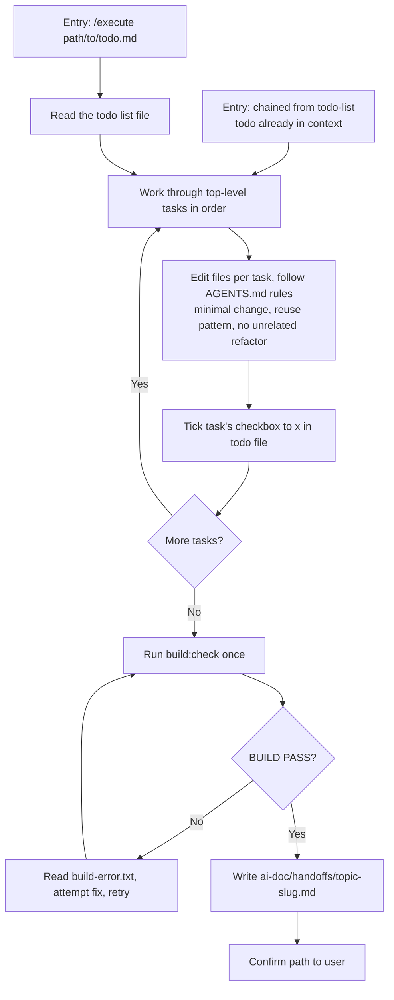

# Execute

Work through a Todo List against real code — editing files, ticking off completed tasks, running the project's build check — then write a Handoff summary to `ai-doc/handoffs/<topic-slug>.md`. This covers the **Execute** and **Summary** steps of requirement > plan > todo list > execute > summary in one pass.

## Process



### 1. Determine the todo source

- If invoked right after `todo-list` confirmed a todo path in this same session, use the todo content already in context — don't re-read the file.
- Otherwise, read the todo file at the path given in `$ARGUMENTS`.

### 2. Work through top-level tasks in order

Follow the dependency order already encoded in the todo list — do not reorder or re-scope tasks. Each top-level task's sub-steps are the unit of work to execute.

### 3. Edit real files per task

Follow this project's `AGENTS.md`/`CLAUDE.md` rules: minimal change, reuse existing patterns/components, no refactor outside the task's scope. If a task is ambiguous or a genuine blocker comes up, ask the user before proceeding rather than guessing.

### 4. Tick the checkbox immediately

As soon as a top-level task is done, change its `- [ ]` to `- [x]` in the todo file itself — not batched at the end. The todo file is the running source of truth for progress, so it should reflect reality even if execution stops partway through.

### 5. Run the build check once, at the end

After all tasks are done (or execution stops early — see below), run the project's `build:check` script exactly once. This is the only script this skill runs itself; per `AGENTS.md` Command Safety, every other script is proposed to the user to run themselves.

- `BUILD PASS` → proceed to writing the Handoff summary.
- `BUILD FAIL` → read the build error output, attempt one fix, then re-run `build:check` once more. If it still fails after that single retry, stop — do not keep looping — and write the Handoff summary documenting the failure (see Output below) instead of continuing to attempt fixes.

### 6. Write the Handoff summary immediately

Once the build check passes, or once execution stops on an unresolved failure, write the Handoff document — no separate draft/approval round-trip.

**Path:** `ai-doc/handoffs/<topic-slug>.md`, where `<topic-slug>` is the source todo list's filename without `.md` (e.g. `ai-doc/todos/user-auth.md` → `ai-doc/handoffs/user-auth.md`).

**Content language:** write the prose content (Context, Files Changed rationale, Important Decisions, Validation notes, Next Step) in whatever language the user used in the conversation. Keep the template's structural headings exactly as written below, regardless of conversation language.

**Template:**

```markdown
# Handoff: <Topic>

## Context
<summary of what this work was and why, drawn from the plan/todo>

## Files Changed
- `path/to/file` — <what changed>

## Important Decisions
<why this approach was chosen during execution, including any deviations from the todo list>

## Validation
BUILD PASS (build:check)
<any additional manual verification steps, if relevant>

## Next Step
<remaining/pending items, if any — omit if execution fully completed with nothing left>
```

If execution stopped early on an unresolved `BUILD FAIL`:
- **Validation** states `BUILD FAIL` with a short description of the remaining error.
- **Next Step** describes what's left to fix, so the user has a clear resume point.

### 7. Confirm

After writing the file, tell the user the Handoff file path and one sentence on whether the build passed or is still failing.
