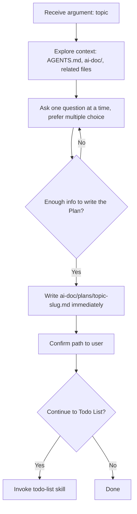

# Interview Plan

Interview the user about `$ARGUMENTS` (the topic) to gather enough context to write a Plan document, then write it to `ai-doc/plans/<topic-slug>.md`. This covers only the **Plan** step of requirement > plan > todo list > execute > summary — do not produce a Todo List, do not write implementation code.

## Process



### 1. Explore context first, always

Before asking anything, read `AGENTS.md` / `CLAUDE.md` and `ai-doc/` in this project, plus any source files the topic plausibly touches. Don't ask the user for information you can find yourself.

### 2. Ask one question at a time

Prefer multiple choice over open-ended. Cover these topics before writing the file — skip any topic the context exploration already answered:

- **Goal** — what to build/fix and why
- **Related files/modules** — which parts of the codebase are involved (if exploration surfaced candidates, ask the user to confirm/correct them instead of asking open-ended)
- **Constraints** — anything that must be preserved or avoided
- **Success criteria** — how to tell the work is done/correct
- **Edge cases / Risks** — only if genuine ambiguity or concern came up; don't ask by default

There is no fixed question count. Stop asking once these topics are covered.

### 3. Write the file immediately

Once the topics above are covered, write the Plan document — no separate draft/approval round-trip.

**Path:** `ai-doc/plans/<topic-slug>.md`, where `<topic-slug>` is lowercase-hyphenated, derived from `$ARGUMENTS` if given, otherwise from the stated goal.

**Content language:** write the prose content (Requirement Summary, Approach, Related Files rationale, Open Questions) in whatever language the user used in the conversation. Keep the template's structural headings and markdown syntax exactly as written below, regardless of conversation language.

**Template:**

````markdown
# Plan: <Topic>

**Date:** YYYY-MM-DD

## Requirement Summary
<summary of the requirement from the conversation>

## Related Files / Modules
- `path/to/file` — <why it's relevant>

## Approach
<short description of the approach>

## Flow


## Open Questions / Risks
- <only if any; omit the section entirely otherwise>
````

### 4. Confirm

After writing the file, tell the user the file path and a one-sentence summary of what it covers.

### 5. Offer to continue to Todo List

Ask the user whether to break the plan down into a Todo List now (multiple choice: yes / not yet). If yes, invoke the `todo-list` skill in this same session, passing the path just written — the plan content is already in context, so don't re-read the file.
