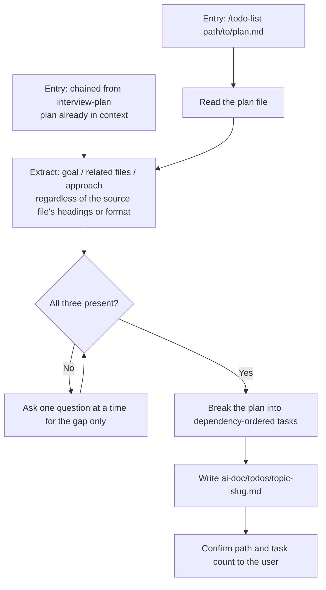

# Todo List

Break a Plan document down into an actionable Todo List, then write it to `ai-doc/todos/<topic-slug>.md`. This covers only the **Todo List** step of requirement > plan > todo list > execute > summary — do not execute any code, do not sync into the session's own todo tracking.

## Process



### 1. Determine the plan source

- If invoked right after `interview-plan` confirmed a plan path in this same session, use the plan content already in context — don't re-read the file.
- Otherwise, read the plan file at the path given in `$ARGUMENTS`.

### 2. Extract from content, not template

Don't require any specific headings — a plan may come from `interview-plan`, another AI, or a human, in any structure. Read the whole file and extract:

- **Goal** — what the plan is trying to build/fix
- **Related files/modules** — what parts of the codebase are involved
- **Approach/scope** — the intended solution and its boundaries

If the file isn't a plan at all (unreadable, unrelated content), tell the user instead of guessing.

### 3. Fill gaps if needed

If any of the three is missing, ask the user about it, one question at a time, before breaking down tasks. Don't re-ask anything already answered in the plan.

### 4. Break into dependency-ordered tasks

- One top-level task = one unit of work completable and verifiable on its own — not a line-by-line code breakdown.
- Order by real dependency (what must happen before what), not the order the plan happens to present things in.
- Sub-steps should be concrete enough to start on without reopening the plan.
- Add a `_Note:_` line only when there's a genuine file/reason/constraint worth flagging — don't restate what the sub-step already says.

### 5. Write the file immediately

Once tasks are broken down, write the Todo List document — no separate draft/approval round-trip.

**Path:** `ai-doc/todos/<topic-slug>.md`, where `<topic-slug>` is the source plan's filename without `.md` (e.g. `ai-doc/plans/user-auth.md` → `ai-doc/todos/user-auth.md`).

**Content language:** write task descriptions, sub-steps, and notes in whatever language the user used in the conversation. Keep the template's structural headings and `- [ ]` / `_Note:_` markers exactly as written below, regardless of conversation language.

**Template:**

```markdown
# Todo List: <Topic>

**Date:** YYYY-MM-DD
**Source Plan:** `ai-doc/plans/<topic-slug>.md`

## Tasks

- [ ] <main step 1>
  - <sub-step>
  - <sub-step>
  - _Note:_ references `path/to/file` — <why it matters / impact>

- [ ] <main step 2>
  - <sub-step>
  - _Note:_ depends on the previous task because <reason>

## Verification
- [ ] <how to confirm the work is done/correct, from the plan's Success Criteria>
```

### 6. Confirm

After writing the file, tell the user the file path and how many top-level tasks it contains.
